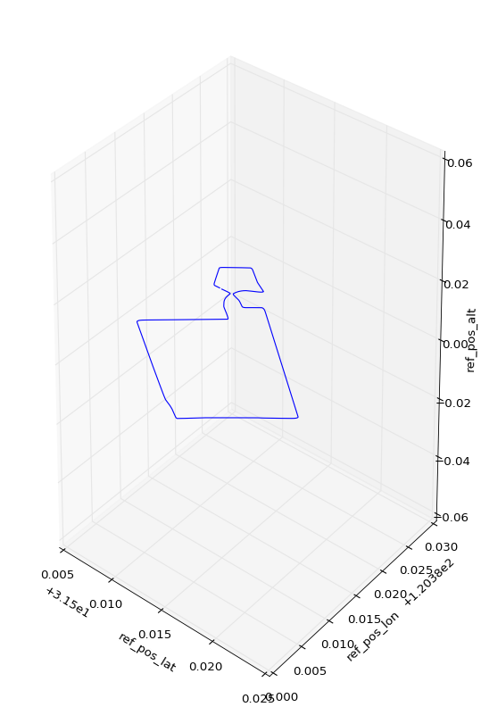
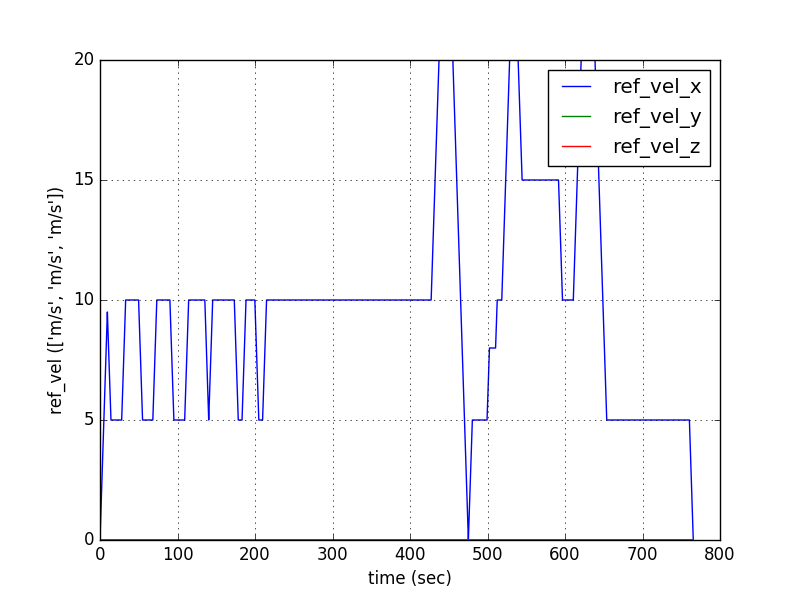
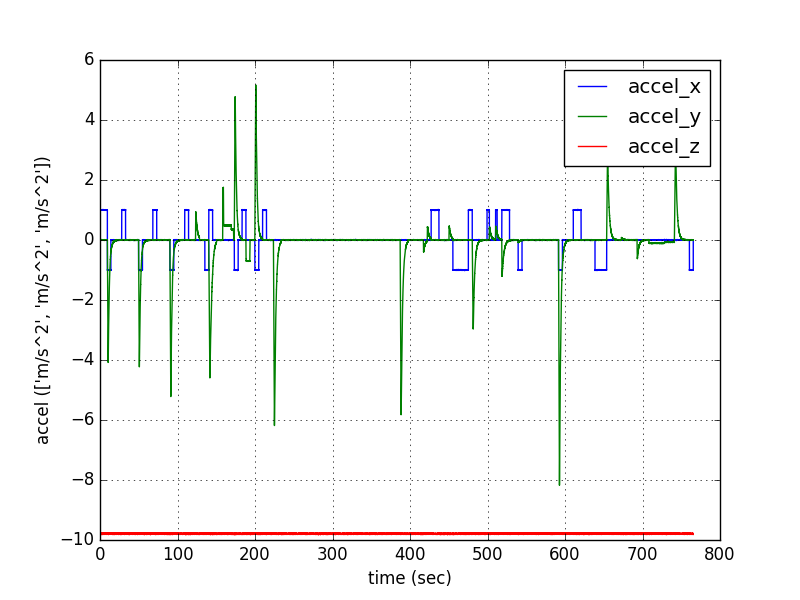
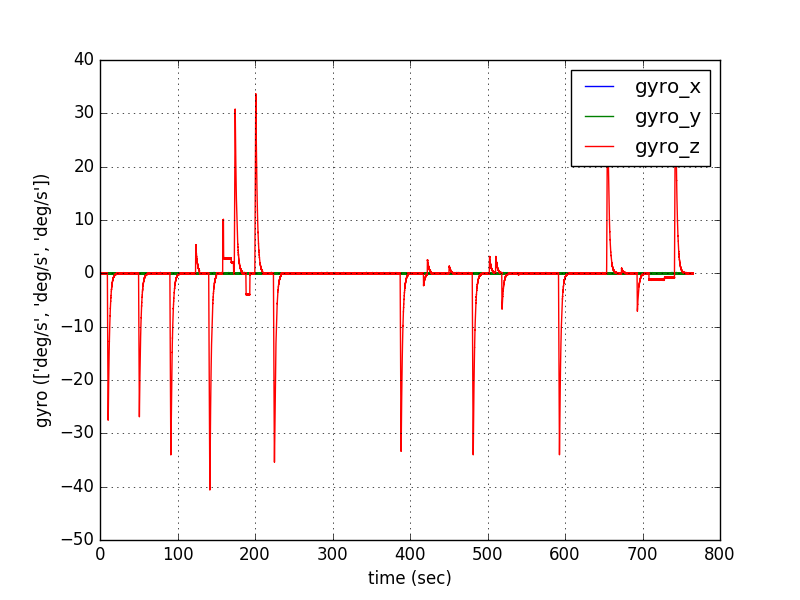
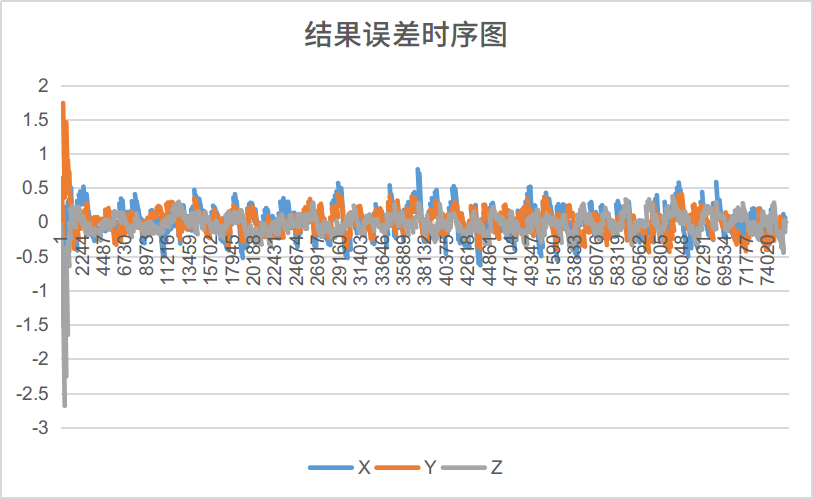

# mscnav
## loose_couple gnss/ins
### 1.简介
GNSS/INS松组合导航功能目前针对实测数据和仿真数据做过一些测试，暂时认为可以使用，所以想发一版针对松组合导航定位的程序。欢迎大家一起讨论学习！
由于我测试的实测数据的所有权并不属于我个人，因此本程序仅仅附带一组仿真数据，该仿真数据来自程序 https://github.com/Aceinna/gnss-ins-sim  在此十分感谢作者。有需要的小伙伴可以前去学习。还是很容易上手的。
### 2.程序相关说明
#### 2.1 依赖与克隆
- glog
- Eigen3

上述的两个依赖库的安装十分简单，大家可以自行百度，在此不做赘述

由于程序采用了submodules形式挂载了tools,因此clone完本程序需要更新tools

```shell
git submodule init
git submodule update
```

执行上述命令才能完整地clone全部程序，否则submodules文件夹为空，编译会有问题
#### 2.2 文件架构

|文件夹|说明|
|-----|-----|
|config|存储配置文件|
|data|数据目录，目前存有一组仿真数据，其中result为程序计算结果目录，sim_data为仿真数据|
|gnss_ins|主程序对应的cc文件目录| 
|include|全部的头文件，包括 1.data-数据流 2.filter-滤波器 3.imu-惯导处理 4.process-量测更新处理|
|src|程序的源码文件，和include对应|
|submodules|子模块，包含tools，基本工具类，在整个程序中都用到|
|test|本来用于存放测试部分的代码，现在主要存了由仿真数据转到我程序可读取文件的小工具和比较结果的小工具|
#### 2.3 程序的编译与运行
- **编译**
完成程序的全部clone后，同时安装好相关依赖，可直接编译程序
```shell
mkdir build && cd build 
cmake .. && make
```
或者直接执行(注意权限)
```shell
./rebuild.sh
```
- **运行**
程序运行也非常简单，给定配置文件和log输出目录即可
```shell
./mscnav_loose_couple ../config/configture.ini ./log
```

#### 2.4 数据说明
- 本程序导航坐标系采用**地心地固坐标系**（ecef）与常用的当地水平坐标系不一致，需要注意
- 本程序imu坐标采用**前-右-下**坐标,同时数据格式为**增量**格式,如果需要跑自己的数据这一点需要小心，注意转换。
- GNSS数据格式较为简单，每一个历元数据一行，每行格式为“GPS周 周内秒 X
 Y Z X的标准差 Y的标准差 Z的标准差”，其中"data/sim_data/gps.txt" 中可以具体参考 
- IMU数据则是二进制的bin数据，直接为程序中ImuData的结构体，具体可以参考程序中 “navstruct.hpp" 文件。
- 当前程序配置的是针对 data/sim_data/下的数据，编译完成后可直接运行
### 3. 程序结果
利用仿真程序生成一组较为简单数据，数据时长约700s,数据轨迹和实际速度如下图所示：

惯性器件的输出如下：


程序结果输出：

由于仿真给定的GPS位置误差std为0.2m，因此程序中存在噪声，全序列统计XYZ三个方向标准差分别为 0.20，0.169，0.170。符合仿真设定值

### 4.学习交流
希望和大家一起学习交流讨论
- QQ: 1280269817
- e-mail: fangwentaowhu@outlook.com   wtfang@whu.edu.cn
