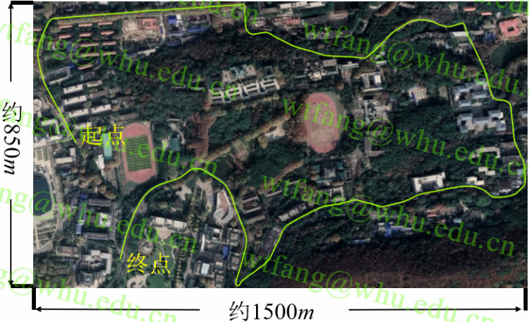
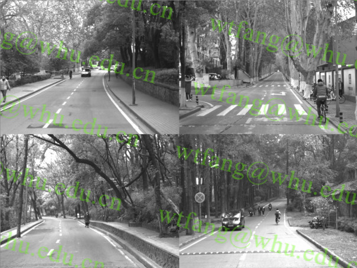
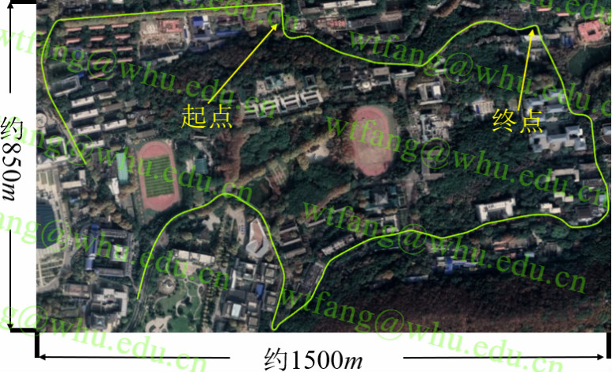
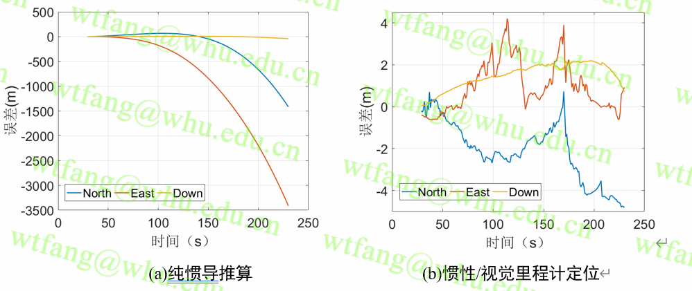
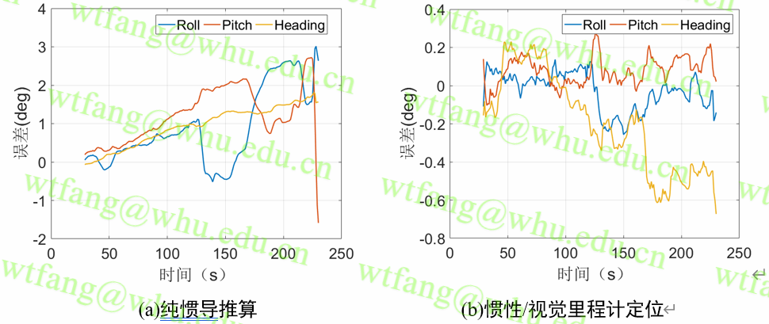
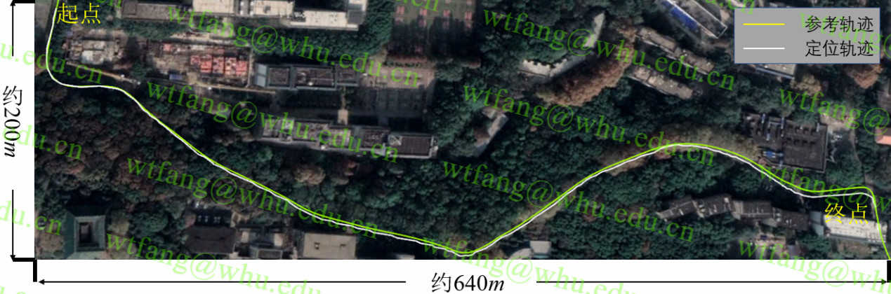
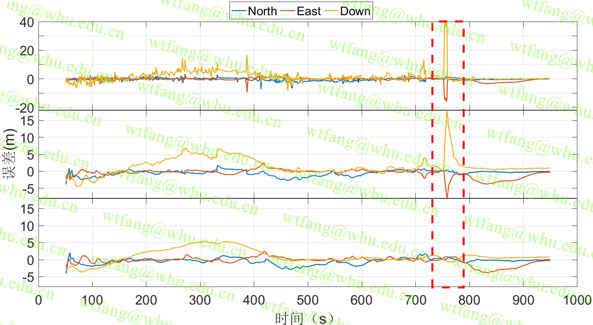
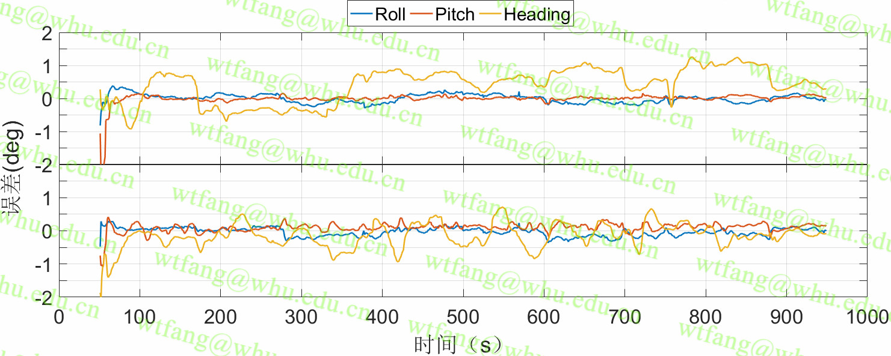

[*方文涛. 大气增强PPP/MEMS惯导/视觉里程计融合定位研究[D].武汉大学,2020.*](https://kns.cnki.net/kcms/detail/detail.aspx?dbcode=CMFD&dbname=CMFD202101&filename=1020969883.nh&uniplatform=NZKPT&v=igHPPI4WEUpm5pnfstuIPr8IXrMwBy9c7iI_utCrWxRiygg7s3p2_Wv9svcczXyT)

pdf版: [大气增强PPP/MEMS惯导/视觉里程计融合定位研究](./doc/大气增强PPP-MEMS惯导-视觉里程计融合定位研究.pdf)

---
### 初衷
- 学习组合导航和VIO相关内容.
- 希望和有兴趣的小伙伴一起交流

### 程序依赖
- glog 
- Eigen
- OpenCV 3.4
- Ceres 1.14.0
---
### 使用说明
最新稳定测试版本对应为dev分支
Multi-Sensor Fusion使用了submodules形式挂载了tools,因此clone完本程序需要更新tools

```shell
git checkout -b dev origin/dev
git submodule init
git submodule update
```
已经安装完依赖库后,可以直接编译程序
```shell
mkdir build && cd build 
cmake .. && make -j3
```

程序运行方式
```shell
./mscnav_bin ${configure_file} ${log_dir}
```
##### 代码架构简要说明
 文件夹名 | 主要作用 
-|-
 config | 示例数据配置文件
 doc | 一些参考文档
exec | 主程序文件
include | 头文件，按照不同功能下面包含子文件夹
script | 一些脚本工具
src | 核心功能的源代码文件
submodules | 子模块，目前仅挂载tools基本工具
test | 一些测试代码
tools | 一些小工具
example_process | 示例数据的百度云链接

### 功能
- 支持GNSS/INS松组合解算
- 支持GNSS/INS/Camera融合解算
- 支持纯惯导推算
- 支持VIO解算，不过需要利用GNSS数据进行全局的初始化
----
### 结果示例
#### 数据说明
- **采集环境及路线**

<center>武汉大学校内林荫环境</center>

- **卫星观测情况（GPS+BDS）**


#### vio结果

<center> vio测试区间:全长770m </center>


<center> 纯惯导和vio定位结果 </center>


<center> 纯惯导和vio定姿结果 </center>


<center> 轨迹对比图 </center>


**<center>结果统计[位置：m,角度：deg]</center>**
-|North|East|Down|误差漂移|Roll|Pitch|Heading
:-:|:-:|:-:|:-:|:-:|:-:|:-:|:-:
纯惯导推算|-1416.3|-3412.4|-40.6|**479.8%**|1.300|1.400|1.072
视觉/惯性里程计|-2.594|4.209|1.578|**0.67%**|0.104|0.106|0.319


#### GNSS-INS-Camera结果

<center> 定位误差图[m] </center>
<center> （上：单频PPP定位；中：单频PPP/INS紧组合定位； 下：GNSS-INS-camera定位） </center>


<center> 定姿误差图[deg] </center>
<center> （上：单频PPP/INS紧组合定姿； 下：GNSS-INS-camera定姿） </center>

**<center>结果统计[位置：m,角度：deg]</center>**
-|H|V|3D|提升|Roll|Pitch|Heading|提升
:-:|:-:|:-:|:-:|:-:|:-:|:-:|:-:|:-:
PPP定位|1.970|4.429|4.847|——|——|——|——|——
大气增强PPP/INS紧组合|1.658|3.014|3.439|**29.04%**|0.132 |0.198 |0.661 |——
大气增强PPP/INS/视觉融合|1.529|2.255|2.725|**43.79%**|0.131 |0.169 |0.389 |**41.10%**

**注：GNSS PPP/INS紧组合部分代码并不在此开源，有兴趣可以私聊联系**

**如果基于RTK技术实现GNSS定位的话,定位效果肯定好于示例结果，之所以采用PPP技术，因为PPP不依赖于基准站，成本和操作难度都更低**

---

### 讨论交流
- QQ: 1280269817
- e-mail: fangwentaowhu@outlook.com   wtfang@whu.edu.cn
